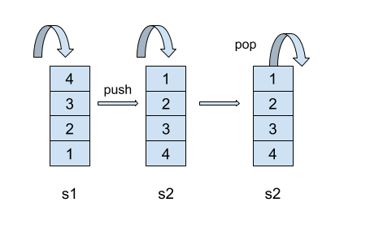

- 问题描述
用两个栈来实现一个队列，完成队列的Push和Pop操作。 队列中的元素为int类型。

- 解题思路
	栈：先进后出－FILO
	队列：先进先出－FIFO
	push的时候使用一个栈s1来存储放入的值，当pop的时候先将s1的值一个个拿出来存储到另一个栈s2，这样从s2出来就是s1的倒序；
	

- 代码实现

```java
import java.util.*;

public class TwoStackQueue{

	Stack<Integer> stack1 = new Stack<Integer>();
    Stack<Integer> stack2 = new Stack<Integer>();
    
    public void push(int node) {
        stack1.push(node); 
    }
    
    public int pop() {
        if(stack2.isEmpty()){
            while(!stack1.isEmpty()){
                stack2.push(stack1.pop());
            }      
        }
        if(stack2.isEmpty()){
            return Integer.MAX_VALUE;
        }
        
        return stack2.pop();
    }

	public static void main(String[] args) {
		TwoStackQueue test = new TwoStackQueue();
		test.push(1);
		test.push(2);
		test.push(3);
		int tmp = Integer.MAX_VALUE;
		while((tmp = test.pop()) != Integer.MAX_VALUE){
			System.out.println("value: " + tmp);
		}
	}
}
```